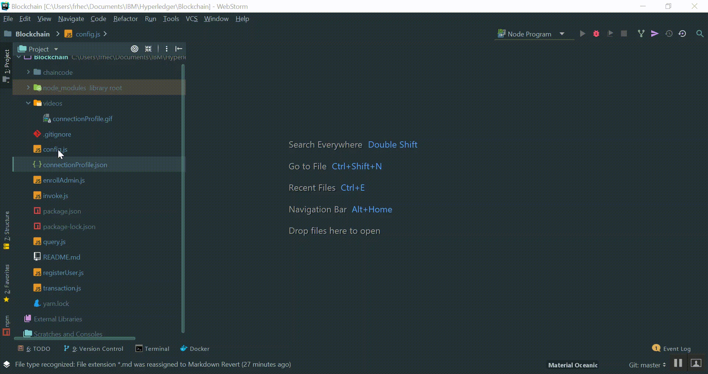

# Crea tu propio Blockchain 

Este programa es un complemento a la siguiente [información](https://blockchain101-essentials.mybluemix.net/)

## Installation

### Requirements
* Python 2.7
* Node 8.9.0
* npm 5.6.0

## Docker

En caso de contar con Docker, el ambiente se puede correr con los siguientes comandos

`$ docker pull frhec/ibmcloudandrev`

`$ docker run -it frhec/ibmcloudandrev bash`

## Configuración

Se tienen que hacer tres pasos.

Paso 1:

Agregar los parámetros de conexión


Paso 2:

Configurar tus credenciales a crear



Paso 3:

Configurar la transacción a realizar


## Uso
```
$ git clone https://github.com/HFR1994/Blockchain.git
$ node enrollAdmin.js
$ node registerUser.js
$ node invoke.js
```

Aquí cambiamos transaction.js a un método de query

`$ node query.js`

## Contribucción

Material distribuido con el permiso de IBM. El contenido creativo y licencia son de su propiedad.

## Licencia
[MIT](https://choosealicense.com/licenses/mit/)